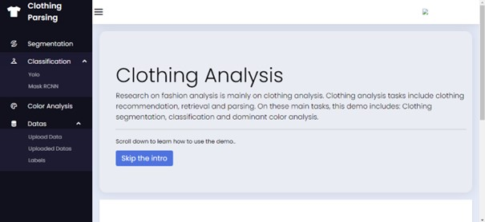
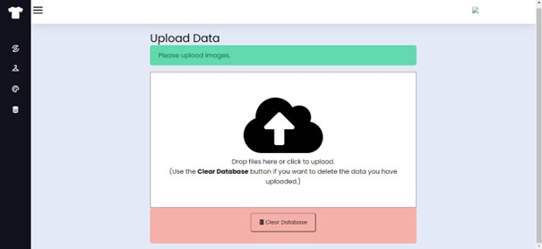
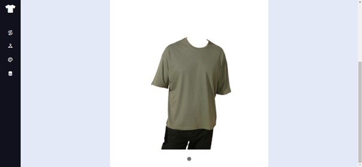
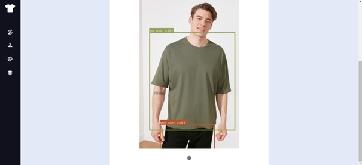
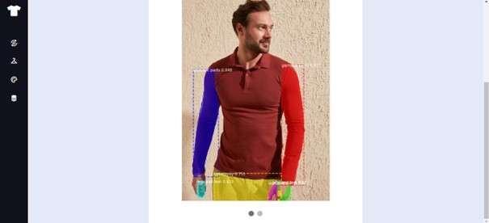
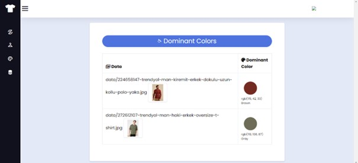

# Clothes Analysis (Classification, Segmentation and Color Analysis)

It is an interface that performs clothing analysis. This interface is coded in flask. Yolo and CNN were used for clothing classification, and U-Net model was used for segmentation. At the same time, the color analysis of the clothes can be displayed in a table.

